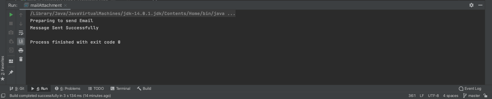
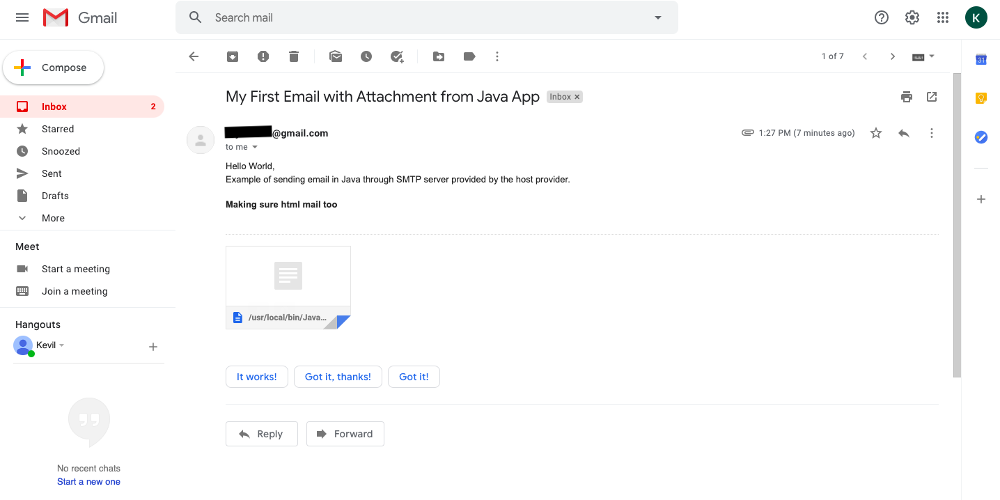

<h2> Sending Email with Attachment in Java </h2>

Platform supporting Maven: [IntelliJ IDEA CE](https://www.jetbrains.com/idea/download/download-thanks.html?platform=mac&code=IIC)

1. Create a new Project

2. Choose [Maven](https://en.wikipedia.org/wiki/Apache_Maven#:~:text=Maven%20is%20a%20build%20automation,%2C%20Scala%2C%20and%20other%20languages.&text=Maven%20is%20built%20using%20a,application%20controllable%20through%20standard%20input.)

3. In Project SDK box, make sure you have latest version of java "JDK"

<p align="center">
	
</p>

4. Click Next, and give a name to your project, like "sendAttachmentProj"

5. Now create a package inside src/test/java/ and name it "sendEmaiLAttachment" then create a class inside it, name it "mailAttachment".


<h4> What is Maven? </h4>

"Maven is a build automation tool used primarily for Java projects. Maven can also be used to build and manage projects written in C#, Ruby, Scala, and other languages.

Maven addresses two aspects of building software: how software is built, and its dependencies. An XML file describes the software project being built, its dependencies on other external modules and components, the build order, directories, and required plug-ins. It comes with pre-defined targets for performing certain well-defined tasks such as compilation of code and its packaging. 

Maven dynamically downloads Java libraries and Maven plug-ins from one or more repositories such as the Maven 2 Central Repository, and stores them in a local cache. Maven projects are configured using a Project Object Model, which is stored in a [pom.xml](https://github.com/kk289/Java-sendEmail-with-Attachment/blob/master/pom.xml) file."

An example of [pom.xml](https://github.com/kk289/Java-sendEmail-with-Attachment/blob/master/pom.xml) file looks like: 

```
<?xml version="1.0" encoding="UTF-8"?>
<project xmlns="http://maven.apache.org/POM/4.0.0"
         xmlns:xsi="http://www.w3.org/2001/XMLSchema-instance"
         xsi:schemaLocation="http://maven.apache.org/POM/4.0.0 http://maven.apache.org/xsd/maven-4.0.0.xsd">
    <modelVersion>4.0.0</modelVersion>

    <groupId>org.example</groupId>
    <artifactId>OpenBrowser</artifactId>
    <version>1.0-SNAPSHOT</version>
    <build>
        <plugins>
            <plugin>
                <groupId>org.apache.maven.plugins</groupId>
                <artifactId>maven-compiler-plugin</artifactId>
                <configuration>
                    <source>8</source>
                    <target>8</target>
                </configuration>
            </plugin>
        </plugins>
    </build>

    <properties>
        <project.build.sourceEncoding>UTF-8</project.build.sourceEncoding>
        <maven.compiler.source>1.7</maven.compiler.source>
        <maven.compiler.target>1.7</maven.compiler.target>
    </properties>

    <dependencies>

        <!-- https://mvnrepository.com/artifact/javax.mail -->
        <dependency>
            <groupId>javax.mail</groupId>
            <artifactId>mail</artifactId>
            <version>1.5.0-b01</version>
            <scope>test</scope>
        </dependency>

    </dependencies>

</project>
```

9. Make sure to setup your "pom.xml" file like above. Just replace your pom.xml file with this [pom.xml](https://github.com/kk289/Java-sendEmail-with-Attachment/blob/master/pom.xml)

10. Let's look at "mailAttachment" class:

## mailAttachment

```
package sendEmailAttachment;

import javax.activation.*;
import javax.mail.*;
import javax.mail.internet.*;
import java.util.Properties;

public class mailAttachment {

    public static void sendMail(String toRecipient, String myAccountEmail, String password) {

        // Get the session object
        Properties properties = new Properties();
        properties.put("mail.smtp.starttls.enable", "true");
        properties.put("mail.smtp.host", "smtp.gmail.com");
        properties.put("mail.smtp.auth", "true");
        properties.put("mail.smtp.port", "587");

        Session session = Session.getDefaultInstance(properties, new javax.mail.Authenticator() {
            protected PasswordAuthentication getPasswordAuthentication() {
                return new PasswordAuthentication(myAccountEmail, password);
            }
        });

        // Compose the Email
        try {
            // Email: Subject Part
            MimeMessage message = new MimeMessage(session);
            message.setFrom(new InternetAddress(myAccountEmail));
            message.setRecipient(Message.RecipientType.TO, new InternetAddress(toRecipient));
            message.setSubject("My First Email with Attachment from Java App");

            // Email: Body Part (Text)
            BodyPart text = new MimeBodyPart();
            text.setText("Hello World, \nExample of sending email in Java through SMTP server provided by the host provider.");

            // Email: Body Part (Html)
            String htmlMessage = "<h4> Making sure html mail too</h4>";
            BodyPart html = new MimeBodyPart();
            html.setContent(htmlMessage, "text/html");

            // Attachment Part
            MimeBodyPart attach = new MimeBodyPart();
            String filename = "/usr/local/bin/JavaAttachmentfile.txt"; // file source
            DataSource source = new FileDataSource(filename);
            attach.setDataHandler(new DataHandler(source));
            attach.setFileName(filename);

            // Multipart object and add MimeBodyPart object to this object
            Multipart multipart = new MimeMultipart();
            multipart.addBodyPart(text);
            multipart.addBodyPart(html);
            multipart.addBodyPart(attach);

            // Set the Multipart object to the message object
            message.setContent(multipart);

            // Send message
            Transport.send(message);
            System.out.println("Message Sent Successfully");

        } catch (NoSuchProviderException e) {
            e.printStackTrace();
        } catch (MessagingException e) {
            e.printStackTrace();
        }
    }

    public static void main(String[] args) {

        System.out.println("Preparing to send Email");
        String toRecipient = "example@gmail.com";  // Receiver Email Address
        final String myAccountEmail = "example@gmail.com"; // Sender Email Address
        final String password = "xxxxx"; // Sender Email password 

        // pass variable to sendMail Method
        sendMail(toRecipient, myAccountEmail, password);
    }
}
```

Let's run the "mailAttachment" class. We get following result: 

<p align="center">
	
	<br>
	<br>
	
</p>

The program run successfully. Make sure you check the inbox whether receiver got any email or not.

<b>Thank you. Let me know if you have any questions.</b>
